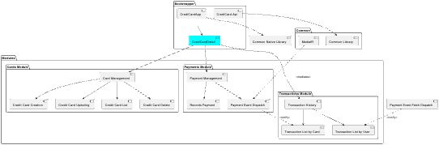

**1. Run WebApp.**   
- cd **_Boostrapper/CrediCardApp**
- run **_npm install_**
- run **_npm run dev_**

**3. Run Backend**  
- cd **_Boostrapper/CrediCard.Api_**
- run **_dotnet restore_**
- run **_dotnet run_**

# Arquitecture

## Modules

### Cards Module

Responsible for Card Management

- Credit Card Creation
- Credit Card Updating
- Credit Card List
- Credit Card Delete

### Payments Module

Responsible for Payment Management

- Records the payment and dispatches a payment event

### Transactions Module

Responsible for transaction history

## Clean arquitecture every module

- List of transactions by card and user